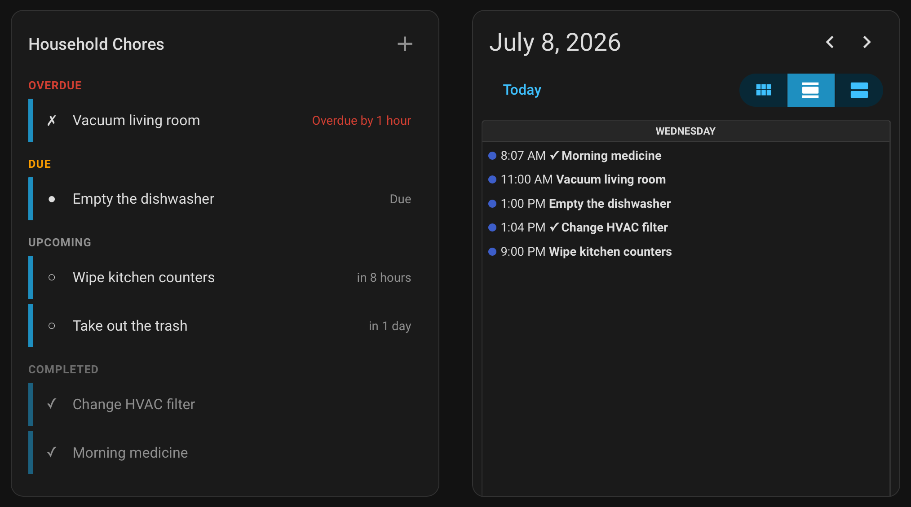
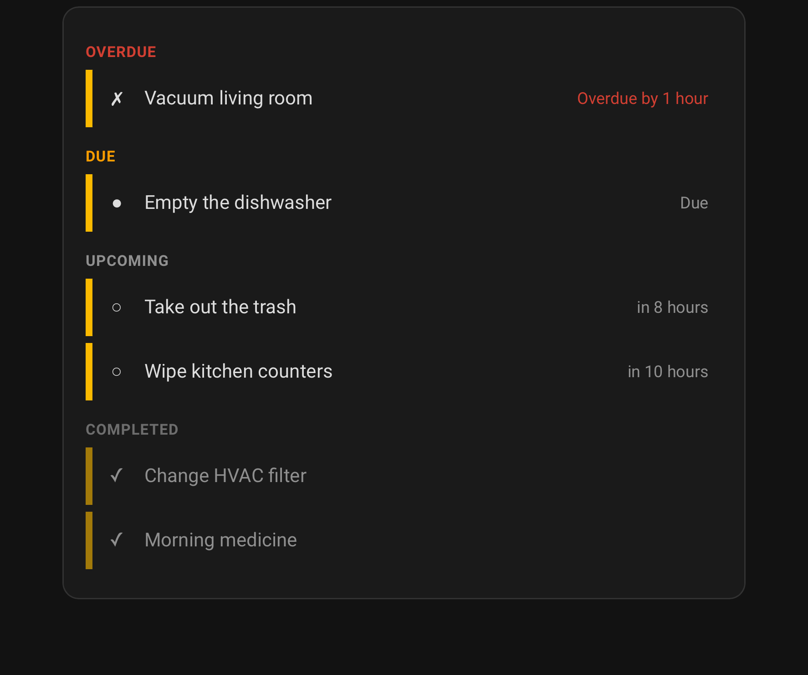
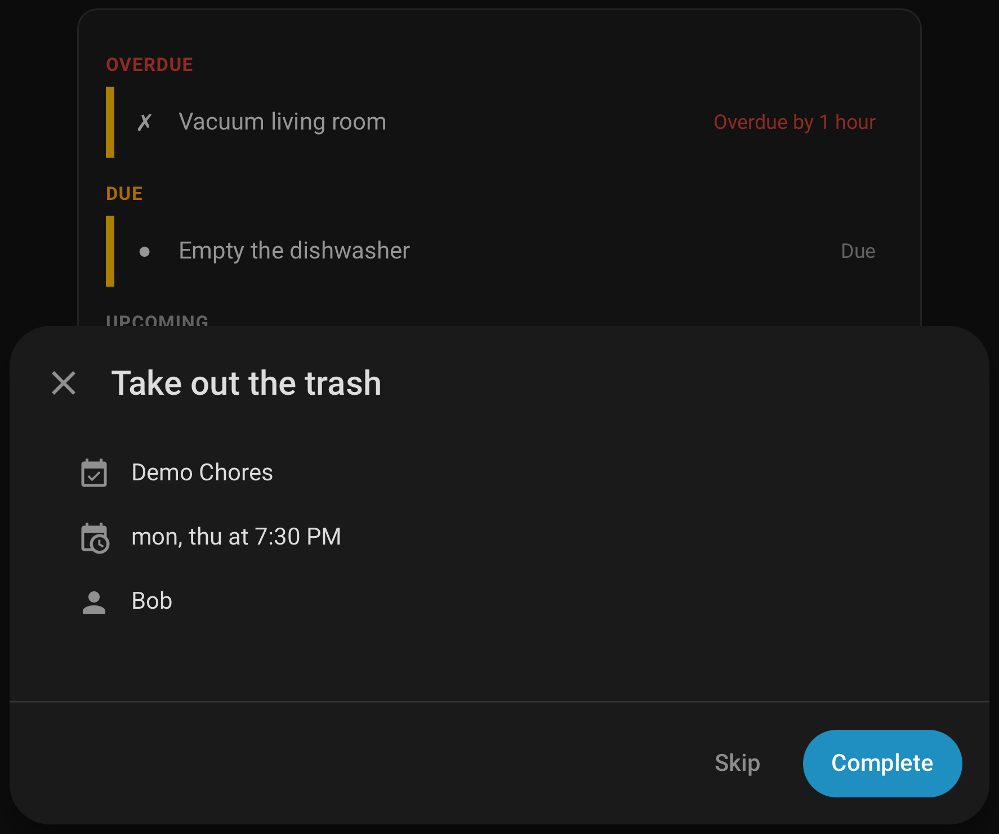

#  Chore Calendar

A Home Assistant custom integration for managing recurring household chores. Each chore list is added through Settings > Integrations, with chores managed via service calls. Provides per-chore sensor entities, a per-list calendar entity, and a per-list todo entity.



## Features

- **Service-driven management**: Create, update, delete, and complete chores via service calls
- **Calendar entity**: Read-only calendar per list showing every upcoming occurrence and recently completed chores
- **Todo entity**: One todo list per chore list, surfacing chores through HA's native todo UI and Assist pipelines — complete, rename, edit descriptions, and reschedule the current occurrence right from the card
- **Sensor entities**: One sensor per chore tracking its current status and attributes
- **Custom Lovelace card**: Built-in timeline card with per-entity filtering, colors, a detail dialog, create/edit/delete dialogs, and configurable actions
- **Tag scan auto-completion**: Assign NFC tags to chores for tap-to-complete; shared tags automatically resolve to the correct chore based on completion windows
- **Flexible scheduling**: Calendar-grid recurrence (daily/weekly/monthly/yearly with weekday ordinals, month days, season windows, and end conditions), interval-based ("after N hours/days/months"), and oneshot (one-time tasks with optional due date) chore types
- **Skip occurrences**: Skip the current occurrence or defer until a later datetime, without touching completion history
- **Status events**: Fires events on chore created, status change, and chore deleted for use in automations
- **Persistent storage**: Chore data stored locally — no external API or cloud dependency

## Quick Start

### Install

**Prerequisites:** [HACS](https://hacs.xyz/) must be installed.

[](https://my.home-assistant.io/redirect/hacs_repository/?owner=tcarney&repository=ha-chore-calendar&category=integration)

1. Click "Download" to install
2. **Restart Home Assistant**

<details>
<summary>Manual Installation</summary>

1. Download the `custom_components/chore_calendar/` folder from this repository
2. Copy it to your Home Assistant's `custom_components/` directory
3. Restart Home Assistant

</details>

### Create a Chore List

1. Go to **Settings** > **Devices & Services** > **Integrations**
2. Click **"+ Add Integration"**
3. Search for **"Chore Calendar"**
4. Enter a name for the list (e.g., "Daily Chores")

Or use the one-click button:

[](https://my.home-assistant.io/redirect/config_flow_start/?domain=chore_calendar)

### Add a Chore

Use the `chore_calendar.create_item` service to add chores to a list. See [Chores](#chores) for all available options and [Add Chores](#add-chores) for more examples.

```yaml
action: chore_calendar.create_item
data:
  entity_id: calendar.daily_chores
  chore_name: "Morning Medicine"
  scheduled:
    frequency: daily
    dtstart: "08:00:00"
```

### Add a Dashboard Card

A custom Lovelace card is included and auto-registered. Search for "Chore Calendar Card" in the card picker, or add it manually. See [Dashboard Card](#dashboard-card) for full configuration options.

```yaml
type: custom:chore-calendar-card
entities:
  - calendar.daily_chores
```

## Chores

Chores are defined by a common four-status cycle, with different [chore types](#chore-types) available for varying behavior.

| Status | Meaning |
| --- | --- |
| `pending` | Actionable but not yet due. Also reported by an unscheduled chore (no due date set yet). |
| `due` | The chore is due now and waiting to be completed |
| `overdue` | The grace period has passed without completion |
| `completed` | The chore has been completed for the current period |

Newly created chores always start in `pending` and progress through the cycle from there. Once `overdue`, the chore stays pinned to its uncompleted period — the status or due date does not advance until the chore is completed.

### Common Options

These apply to all chore types:

| Option | Required | Default | Description |
| --- | --- | --- | --- |
| `chore_name` | yes | — | Display name for the chore |
| `description` | no | — | Free-text detail, shown in the card's detail dialog and on calendar events |
| `pending_period` | no | 3 hours | How long before the due time the chore reads as `pending` (upcoming, completable early) |
| `grace_period` | no | 1 hour | How long after the due time before the chore becomes `overdue` |
| `trigger_entity` | no | — | A `tag.*` entity for NFC tap-to-complete (see [Tag Triggers](#tag-triggers)) |
| `assigned_to` | no | — | List of `person.*` entities assigned to the chore (informational, shown in card and events) |

Duration values use the standard Home Assistant format: `hours: 3`, `days: 14`, `minutes: 30`, etc.

Set `pending_period: 0` to skip the `pending` state entirely — the chore goes straight from `completed` to `due`. Useful for interval chores where an early window doesn't make sense (e.g. "every 90 days").

A chore with no prior completion stays in `pending` until its first cycle becomes due. Once any completion is on record, the chore stays `completed` between cycles and only re-enters `pending` when its next `pending_at` arrives. For oneshot chores, `pending_period` also defines the minimum forward leap required to reactivate a completed chore via reschedule (a new `due_datetime` whose `pending_at` is at or before `last_completed` keeps the chore `completed`).

### Common Attributes

The chore sensor's state is the chore's current status. Additional attributes are exposed alongside it:

| Attribute | Description |
| --- | --- |
| `uid` | Stable UUID assigned at creation. Used as the `item` argument when targeting a specific chore via the calendar entity in service calls. |
| `chore_type` | The chore type, set at creation by which sub-dict is passed. Changeable later by passing a different type's sub-dict to `update_item` (see [Update a Chore](#update-a-chore)). |
| `next_due` | When the chore is next due (ISO 8601). `null` for unscheduled chores. Stays pinned to the uncompleted period while `overdue`. |
| `last_completed` | When the chore was last completed (ISO 8601), or `null` if never completed. |
| `last_completed_by` | The `person.*` entity that completed the chore, or `null`. Populated via the optional `completed_by` parameter on `chore_calendar.complete_item`; shown in the card detail dialog and included in status events. |

### Chore Types

Scheduled and interval chores follow the same recurrence model — the only difference is the **anchor** they recur from:

- **Scheduled chores are anchored to the calendar grid.** They recur **every** N units on fixed dates, whether or not the chore is ever completed — so a brand-new one becomes `due` on its first occurrence even before it has ever been done.
- **Interval chores are anchored to the last completion.** They recur **after** N units have elapsed since the chore was last done — so a brand-new one stays `pending` with no due date until its first completion starts the clock.

For example: the trash goes out *every* Tuesday → scheduled; the water filter is replaced 90 days *after* the last change → interval.

#### Scheduled Chores

Recur on a fixed calendar grid — the same recurrence options as a calendar event's repeat rule.

| Option | Required | Default | Description |
| --- | --- | --- | --- |
| `frequency` | yes | — | The recurrence unit — `daily`, `weekly`, `monthly`, or `yearly` |
| `interval` | no | `1` | Recur **every** N units (`weekly` + `2` → every 2 weeks) |
| `byday` | no | — | Days of the week (`mon`–`sun`). Monthly/yearly rules also accept an ordinal prefix (`-1fri` = last Friday) |
| `bymonthday` | no | — | Days of the month (`15`, or `-1` for the last day). Monthly/yearly only |
| `bysetpos` | no | — | Nth match of `byday` within the month (`-1` = last). Requires `byday`; monthly/yearly only |
| `bymonth` | no | — | Season window — only grid occurrences in these months (1–12) are valid |
| `dtstart` | no | `08:00:00` | Time of day for every occurrence, or a full datetime to anchor the series phase when `interval` is above 1 |
| `until` | no | — | The series ends after this date/datetime. Mutually exclusive with `count` |
| `count` | no | — | Ends the series after this many **occurrences** — grid points, spent as the calendar advances (a skipped or missed occurrence still counts). Mutually exclusive with `until` |
| `persist` | no | `false` | Keep the chore once the series ends; otherwise `hide_completed_items` deletes it |

The rule is stored as an RFC 5545 RRULE, and the calendar entity shows every future occurrence in the queried window.

A never-completed scheduled chore pins to the first occurrence at or after `created_at`. Creating a chore past today's occurrence pins to the next one (so the chore reads `pending`, never immediately `due`). If that first cycle is missed, the chore stays `overdue` until completed — it does not silently roll forward to a later period.

With `until` or `count`, completing (or skipping past) the final occurrence ends the series: the chore reports `completed` permanently and is swept by the next `hide_completed_items` call unless `persist` is set. Uncompleting the final completion — or updating the recurrence — reopens it.

#### Interval Chores

Recur a fixed period after the last completion.

| Option | Required | Default | Description |
| --- | --- | --- | --- |
| `frequency` | yes | — | The recurrence unit — `minutely`, `hourly`, `daily`, `weekly`, `monthly`, or `yearly` |
| `interval` | no | `1` | Recur **after** N units (`daily` + `5` → after 5 days; `monthly` + `3` → after 3 months) |
| `bymonth` | no | — | Season window — the **after** clock only runs in these months; out-of-season time doesn't count |
| `until` | no | — | The series ends once the next due passes this. Mutually exclusive with `count` |
| `count` | no | — | Ends the series after this many **occurrences** — and since an interval occurrence exists only once completed, this equals this many completions. Mutually exclusive with `until` |
| `persist` | no | `false` | Keep the chore once the series ends; otherwise `hide_completed_items` deletes it |

Month and year intervals track the calendar — "after 3 months" from January 31 lands April 30, not 90 fixed days. With a season window, the interval clock only runs during the allowed months (a completion out of season starts the clock at the next season opening).

A never-completed interval chore reports `pending` with no `next_due` until the first completion anchors the cycle. Tag-scan auto-completion still works in this state — the first scan establishes the cycle.

#### Oneshot Chores

Non-recurring tasks with an optional due datetime. Unlike scheduled and interval chores, a oneshot has no built-in cadence. The status will not cycle from `completed` to `pending` automatically. This is useful for chores where the due date is defined by an external source, such as an automation or script.

| Option | Required | Default | Description |
| --- | --- | --- | --- |
| `due_datetime` | no | — | When the chore is due. Omit to create an unscheduled chore that can be rescheduled later via `update_item`. |
| `persist` | no | `false` | When `false`, the chore is deleted on the next `hide_completed_items` call once completed. When `true`, the chore stays in storage so it can be reactivated via `update_item` with a new `due_datetime`. |

Behaviors specific to oneshot:

- **Optional due date**: a oneshot created without `due_datetime` reports `pending` until a date is set or the chore is completed directly. Useful for ad-hoc todo-style items ("Buy milk") and "someday" tasks.
- **Reschedule via update_item**: writing a new `due_datetime` to a completed oneshot reactivates it through the standard pending/due/overdue cycle. Closer values (within the pending window of `last_completed`) keep the chore completed — guards against accidental reactivation by past dates.
- **Skip default clears the date**: `skip_item` with no `until` on a oneshot clears `due_datetime` (the chore enters the unscheduled pending state). Use `update_item` to reschedule. `skip_item` with explicit `until` works the same as scheduled/interval.
- **Cleanup behavior**: terminal-completed oneshots with `persist: false` are deleted on the next `hide_completed_items` call. Set `persist: true` for chores that recur irregularly via external scripts.

### Tag Triggers

Assigning a `tag.*` entity to a chore enables NFC tap-to-complete. When the tag is scanned, the integration checks whether the chore is currently in its completion window (pending window through overdue) and auto-completes it.

If multiple chores share the same tag, only the chore whose completion window matches the scan time is completed.

When a chore is created with a `trigger_entity`, the tag's last-scanned timestamp is used to seed `last_completed` — this allows migration from existing tag-based systems without losing the most recent completion. Note that the chore's initial status will reflect the seeded `last_completed` (typically `completed` for a recently-scanned tag), not the standard never-completed `pending`.

## Services

Services are the primary method of managing `chore_calendar` entities.

### Add Chores

```yaml
# Scheduled chore — weekdays at 8 AM with NFC tag trigger
action: chore_calendar.create_item
data:
  entity_id: calendar.daily_chores
  chore_name: "Morning Medicine"
  scheduled:
    frequency: weekly
    byday: [mon, tue, wed, thu, fri]
    dtstart: "08:00:00"
  trigger_entity: tag.morning_medicine_nfc

# Scheduled chore — last Friday of every month
action: chore_calendar.create_item
data:
  entity_id: calendar.daily_chores
  chore_name: "Deep-Clean the Kitchen"
  scheduled:
    frequency: monthly
    byday: [fri]
    bysetpos: [-1]
    dtstart: "09:00:00"

# Interval chore — 90 days after the last completion
action: chore_calendar.create_item
data:
  entity_id: calendar.daily_chores
  chore_name: "Change Water Filter"
  interval:
    frequency: daily
    interval: 90
  grace_period:
    days: 14

# Interval chore — every 3 months, only October through March
action: chore_calendar.create_item
data:
  entity_id: calendar.daily_chores
  chore_name: "Change Furnace Filter"
  interval:
    frequency: monthly
    interval: 3
    bymonth: [10, 11, 12, 1, 2, 3]

# Oneshot chore — single deadline with a 7-day pending window
action: chore_calendar.create_item
data:
  entity_id: calendar.daily_chores
  chore_name: "File Taxes"
  oneshot:
    due_datetime: "2026-04-15T10:00:00-04:00"
  pending_period:
    days: 7

# Unscheduled oneshot — ad-hoc todo, scheduled later via update_item
action: chore_calendar.create_item
data:
  entity_id: calendar.daily_chores
  chore_name: "Buy Milk"
  oneshot: {}
```

### Complete a Chore

```yaml
# By sensor entity (chore inferred)
action: chore_calendar.complete_item
data:
  entity_id: sensor.daily_chores_morning_medicine

# By calendar entity + item name or UID
action: chore_calendar.complete_item
data:
  entity_id: calendar.daily_chores
  item: "Morning Medicine"

# Record a completion at a specific time (e.g. backfilling)
action: chore_calendar.complete_item
data:
  entity_id: sensor.daily_chores_morning_medicine
  completed_at: "2026-04-20 07:30:00"
  completed_by: person.alice
```

`completed_at` takes a datetime — enter it directly in YAML or use the picker in Developer Tools. Defaults to now when omitted.

Completing a chore clears any active skip by default. Pass `keep_skip: true` to preserve the skip — useful when you complete early but still want the deferral to hold until the originally scheduled `skipped_until`.

```yaml
action: chore_calendar.complete_item
data:
  entity_id: sensor.daily_chores_morning_medicine
  keep_skip: true
```

### Skip a Chore

Defer a chore without recording a completion. `last_completed` is untouched — skipping does not count as doing the chore. While a skip is in force, the chore's status reports as `completed` and `next_due` becomes the deferred datetime; the normal state machine (pending window, grace period) runs around it.

Provide `until` to pick the exact resume datetime, or omit it to use the type-specific default:

- **Scheduled chores**: the next occurrence.
- **Interval chores**: `now + interval`.
- **Oneshot chores**: clears `due_datetime`, leaving the chore unscheduled. Use `update_item` to set a new date. Skipping a terminal-completed oneshot raises an error.

```yaml
# Skip the current occurrence (scheduled → next occurrence, interval → now + interval)
action: chore_calendar.skip_item
data:
  entity_id: sensor.daily_chores_morning_medicine

# Defer until an explicit datetime
action: chore_calendar.skip_item
data:
  entity_id: calendar.daily_chores
  item: "Morning Medicine"
  until: "2026-04-28 09:00:00"
```

`until` takes a datetime — enter it directly in YAML or use the picker in Developer Tools — and works in both directions: a value *earlier* than the natural due pulls the occurrence forward ("do it tomorrow instead of Monday"), and re-skipping with a new value moves an existing skip. Skipping a chore whose `until`/`count` series has ended raises an error, and skipping past the final occurrence ends the series.

To undo a skip, re-skip with a new `until`, or clear the item's due date from the [native todo card](#native-todo-card) to drop the override entirely and return to the normal schedule.

Completing a skipped chore clears the skip, so the completion counts for the current cycle (unless `keep_skip: true`). Uncompleting that completion restores the prior skip state — the undo is symmetric with `last_completed`.

### Uncomplete a Chore

Revert the most recent completion — useful when a chore was marked complete by mistake (e.g. an accidental NFC tap). Uncomplete is a one-level undo: it restores the previous `last_completed` and `last_completed_by` (or clears them when undoing the first-ever completion). Attempting to uncomplete a chore that has never been completed raises an error.

```yaml
# By sensor entity (chore inferred)
action: chore_calendar.uncomplete_item
data:
  entity_id: sensor.daily_chores_morning_medicine

# By calendar entity + item name or UID
action: chore_calendar.uncomplete_item
data:
  entity_id: calendar.daily_chores
  item: "Morning Medicine"
```

The resulting `chore_calendar_status_changed` event carries `source: uncomplete` so automations can distinguish an undo from natural period transitions. See [Automation Events](#chore_calendar_status_changed) for the full source vocabulary.

### Hide Completed Items

Set a per-list cutoff for hiding completed items from the calendar and todo entities. Items completed *before* the cutoff are hidden but their `last_completed` timestamps are preserved (recurring chores still compute state correctly; the next cycle reappears naturally). Finished chores without `persist` — completed oneshots, and recurring chores whose `until`/`count` series has ended — are deleted from storage during this call, firing `chore_calendar_item_deleted` for each.

```yaml
# Hide all completed items as of now
action: chore_calendar.hide_completed_items
data:
  entity_id: calendar.daily_chores

# Keep only items completed in the last 24 hours
action: chore_calendar.hide_completed_items
data:
  entity_id: calendar.daily_chores
  keep_for:
    hours: 24

# Hide everything completed before a specific date
action: chore_calendar.hide_completed_items
data:
  entity_id: calendar.daily_chores
  before: "2026-04-01 00:00:00"
```

`before` and `keep_for` are mutually exclusive. Omit both for cutoff = now.

### Update a Chore

```yaml
action: chore_calendar.update_item
data:
  entity_id: sensor.daily_chores_morning_medicine
  chore_name: "Morning Vitamins"
  scheduled:
    dtstart: "07:30:00"
```

Passing any recurrence field (`frequency`, `byday`, `until`, …) replaces the repeat rule, with `frequency` required; `dtstart` and `persist` alone tweak the start time or lifecycle while keeping the stored rule — as above. Updating the recurrence also reopens a chore whose `until`/`count` series had ended.

#### Convert Between Chore Types

Passing a sub-dict for a **different** type converts the chore in place:

```yaml
# Convert an interval chore into a fixed-deadline oneshot
action: chore_calendar.update_item
data:
  entity_id: sensor.daily_chores_change_water_filter
  oneshot:
    due_datetime: "2026-05-01T09:00:00-04:00"
```

Conversion preserves the chore's identity (`uid`), name, description, tag trigger, assignees, and pending/grace windows. It rebuilds the schedule from the new selector and starts a **fresh cycle** — completion history (`last_completed`, completion count) and any active skip are cleared, since neither carries meaning across schedule types (an interval chore, for example, anchors its next due on the last completion, so a stale timestamp would read as immediately overdue). Only one type sub-dict may be passed per call, and converting **to** a oneshot requires a `due_datetime` key (it may be `null` for an unscheduled oneshot).

### Delete a Chore

```yaml
action: chore_calendar.delete_item
data:
  entity_id: sensor.daily_chores_morning_medicine
```

### List Chores

Returns all chores in a list, optionally filtered by status. Useful in automations and templates.

```yaml
action: chore_calendar.get_items
data:
  entity_id: calendar.daily_chores
  status: overdue
response_variable: result
# result.items contains the list of matching chores
```

## Dashboard Card

A custom Lovelace card is included and auto-registered — no manual resource setup needed. Add it to a dashboard via the UI card picker or YAML.



### Minimal Configuration

```yaml
type: custom:chore-calendar-card
entities:
  - calendar.daily_chores
```

### Full Configuration

| Option | Default | Description |
| --- | --- | --- |
| `entities` | required | List of `chore_calendar` calendar entities to display |
| `entities[].color` | auto | Color for the entity's left bar (HA theme name like `"red"` or CSS value like `"#4FC3F7"`) |
| `entities[].exclude` | `[]` | Statuses to hide for this entity: `overdue`, `due`, `pending`, `completed` |
| `title` | none | Card title text |
| `hide_completed` | `false` | Hide the completed section entirely |
| `due_date_period` | none | Duration dict — hide `pending` chores whose `next_due` is further in the future than this. Overdue and due chores are always shown. |
| `completed_period` | none | Duration dict — hide `completed` chores whose `last_completed` is further in the past than this. |
| `hide_section_headers` | `false` | Hide section headings (Overdue, Due, Upcoming, Completed) |
| `hide_card_background` | `false` | Hide the card background (transparent) |
| `allow_uncomplete` | `false` | Show an "Uncomplete" button on completed rows in the detail dialog |
| `hide_add_button` | `false` | Hide the header "+" button that opens the create-chore dialog |
| `hide_edit_button` | `false` | Hide the "Edit" button in the chore detail dialog |
| `update_interval` | `60` | Seconds between data refreshes |
| `tap_action` | `details` | [Action](#action-configuration) on row tap |
| `hold_action` | `none` | [Action](#action-configuration) on row hold (500ms) |
| `double_tap_action` | `none` | [Action](#action-configuration) on row double-tap |

<details>
<summary>Complete Example</summary>

```yaml
type: custom:chore-calendar-card
title: "Chores"
entities:
  - entity: calendar.daily_chores
    color: "#4FC3F7"
    exclude:
      - completed
  - entity: calendar.weekly_chores
    color: "#81C784"
title: Chores
hide_completed: false
due_date_period:
  days: 7
completed_period:
  days: 14
hide_section_headers: false
hide_card_background: false
update_interval: 60
tap_action:
  action: details
hold_action:
  action: none
double_tap_action:
  action: none
```

</details>

### Action Configuration

Chore rows support configurable tap, hold, and double-tap actions:

| Action | Behavior |
| --- | --- |
| `details` | Open the chore detail dialog (default for tap) |
| `edit` | Open the create/edit dialog for the chore |
| `complete` | Complete the chore directly, no dialog |
| `more-info` | Open HA's more-info panel for the calendar entity |
| `navigate` | Navigate to a dashboard path |
| `url` | Open an external URL |
| `call-service` | Call an arbitrary HA service |
| `none` | Do nothing (default for hold and double-tap) |

Example — tap to complete, hold for details:

```yaml
type: custom:chore-calendar-card
entities:
  - entity: calendar.daily_chores
tap_action:
  action: complete
hold_action:
  action: details
```

### Detail Dialog



Tapping a chore row (default behavior) opens a detail dialog showing:

- List name (with entity icon)
- Schedule description (e.g. "Last Friday at 9:00 AM")
- Assignee(s) (if assigned)
- Trigger tag (if configured)
- Last completed time and by whom (if set)
- The chore's free-text description (if set)

An "Edit" button in the dialog footer opens the create/edit dialog for the chore (hidden when `hide_edit_button` is set). For non-completed chores, "Skip" and "Complete" buttons also appear. Skip defers the chore using the type-specific default (see [Skip a Chore](#skip-a-chore)); Complete records the completion and clears any active skip. For completed chores, an "Uncomplete" button is shown when `allow_uncomplete` is enabled — uncomplete restores the skip that was cleared by the completion.

### Creating & Editing Chores

The card manages chore definitions directly — no service calls required for everyday changes.

- **Create**: the header "+" button opens a dialog to add a chore (hidden when `hide_add_button` is set).
- **Edit**: the detail dialog's "Edit" button — or an `edit` [row action](#action-configuration) — opens the same form pre-filled for the chore.
- **Delete**: the edit dialog has a "Delete" button with an inline confirmation step.

The form covers the common fields plus a **Type** toggle (Scheduled / Interval / Oneshot) that drives per-type recurrence inputs mirroring HA's calendar repeat editor: frequency, an interval with a dynamic unit, weekday toggles, a computed monthly mode (day-of-month vs Nth weekday) derived from the Start date, a Start date/time, the interval season window, the oneshot due date, and the `until` / `count` lifecycle with a persist toggle. Pending/grace periods, the tag trigger, assignees, and a target-list dropdown (shown only when more than one list is configured) round it out.

Changing the Type toggle on an existing chore converts it on save, backed by the same [cross-type conversion](#convert-between-chore-types) as `update_item`. A few advanced scheduled options — the season window (`bymonth`) and yearly day-of-month (`bymonthday`) — are set via the service only; the edit form preserves any stored values through a round-trip rather than dropping them.

### Visual Editor

All options are configurable through the visual editor — no YAML required. Each entity is shown as a collapsible panel (collapsed: entity name with color dot; expanded: entity picker, color picker, exclude statuses multi-select, and remove button). Card-level options include toggle switches, number inputs, and action type dropdowns.

### Native Todo Card

Each chore list also works with HA's built-in [todo-list card](https://www.home-assistant.io/dashboards/todo-list/):

```yaml
type: todo-list
entity: todo.daily_chores
```

The default tap action (`edit`) opens HA's item editor, where you can rename a chore, edit its description, and change its due date; set `item_tap_action: toggle` if you'd rather have tapping toggle completion directly. Due edits reschedule the **current occurrence only** — never the recurrence:

- **One-shot chores**: the due date is edited directly; clearing it leaves the chore unscheduled, and setting a date on a completed one-shot reopens it.
- **Scheduled / interval chores**: a changed due date acts like [`skip_item`](#skip-a-chore) with an explicit `until` — later defers the occurrence, earlier pulls it forward. A skipped chore shows in the completed section with its deferred date as the due; clearing that due date undoes the skip and returns the chore to its normal schedule. Clearing the due of a chore with no skip in force is rejected (the due comes from the schedule).

To change a chore's recurrence, use [`chore_calendar.update_item`](#update-a-chore) or the chore card's edit dialog. Adding and deleting items from the todo card is not supported — use the [services](#services) or the chore card.

## Automation Events

### `chore_calendar_status_changed`

Fired on status transitions. The required `source` field describes *why* the status changed, so automations can distinguish service-driven actions from natural schedule progression.

```yaml
event_type: chore_calendar_status_changed
data:
  uid: "01244b28-e604-11ee-a0a4-e45f0197c057"
  chore_name: "Morning Medicine"
  entity_id: "calendar.daily_chores"
  from_status: "pending"
  to_status: "due"
  next_due: "2026-03-23T08:00:00-04:00"
  assigned_to: ["person.alice"]
  source: "schedule"
```

| `source`     | When fired                                                                                  |
|--------------|---------------------------------------------------------------------------------------------|
| `schedule`   | Coordinator tick crossed a threshold (default — natural progression).                       |
| `complete`   | `complete_item` service or todo entity `needs_action → completed` toggle.                   |
| `uncomplete` | `uncomplete_item` service or todo entity `completed → needs_action` toggle.                 |
| `skip`       | `skip_item` service.                                                                        |
| `update`     | `update_item` whose field change flipped the operative anchor enough to change status.      |
| `tag`        | `tag_scanned` listener auto-completion.                                                     |

A skip whose pre- and post- status are both `completed` (e.g. early-completed scheduled chore deferring its next cycle further) doesn't fire this event because there's no transition. The chore's `skipped_until` attribute on its sensor is still observable via HA's standard `state_changed`.

### `chore_calendar_item_created`

Fired when a chore is added to storage via `create_item`. Mirrors `chore_calendar_item_deleted` so automations can react to the full CRUD lifecycle.

```yaml
event_type: chore_calendar_item_created
data:
  uid: "01244b28-e604-11ee-a0a4-e45f0197c057"
  chore_name: "Morning Medicine"
  chore_type: "scheduled"
  entity_id: "calendar.daily_chores"
  status: "pending"
  next_due: "2026-03-23T08:00:00-04:00"
  assigned_to: ["person.alice"]
```

`status` reflects the chore's state at creation. It's typically `pending`, but a chore created with a `trigger_entity` whose tag was recently scanned will report `completed` because the seeded `last_completed` timestamp lands inside the current cycle's pending window (see [Tag Triggers](#tag-triggers)).

### `chore_calendar_item_deleted`

Fired when a chore is removed from storage via `delete_item`, or swept by `hide_completed_items` for finished `persist=false` chores. Useful for cleanup automations or external sync.

```yaml
event_type: chore_calendar_item_deleted
data:
  uid: "01244b28-e604-11ee-a0a4-e45f0197c057"
  chore_name: "Morning Medicine"
  chore_type: "scheduled"
  entity_id: "calendar.daily_chores"
```

## Troubleshooting

Enable debug logging by adding to `configuration.yaml`:

```yaml
logger:
  default: info
  logs:
    custom_components.chore_calendar: debug
```

## Development Setup

Requires Docker Desktop and VS Code with the [Dev Containers extension](https://marketplace.visualstudio.com/items?itemName=ms-vscode-remote.remote-containers).

1. Clone this repository
2. Open in VS Code
3. Click "Reopen in Container" when prompted

## Acknowledgements

- Inspiration from [Chore Helper](https://github.com/VolantisDev/ha-chore-helper)
- For full-featured chores with gamification, etc. check out [ChoreOps](https://github.com/ccpk1/ChoreOps)
- Card styling based on [week-planner-card](https://github.com/FamousWolf/week-planner-card), which I use for calendars on all of my dashboards

## License

This project is licensed under the MIT License - see the [LICENSE](LICENSE) file for details.
